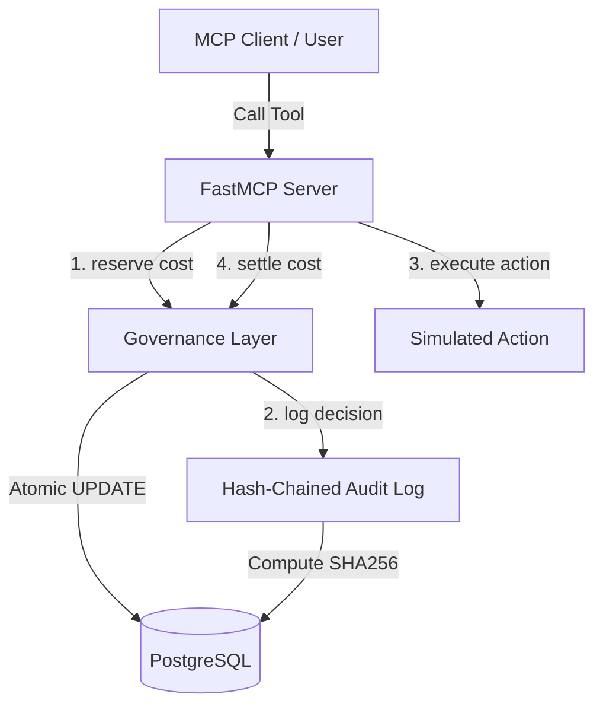

# Agent Spending Governor (MCP Server)

A governed spending-reservation and audit-logging system for AI agents, built with FastAPI, PostgreSQL, `asyncpg`, and FastMCP.

This repository implements a secure, robust sandbox environment that enforces resource limits, permission scopes, and tamper-evident audit trails on actions taken by autonomous agents.

---

## Architecture Overview



### 1. Atomic Spend Reservation (`app/governance.py`)
To prevent double-spending and race conditions, the governance system does not use a typical read-then-write check. Instead, budget validation, status check, permission lookup, and budget reservation are performed in a **single atomic `UPDATE` statement**:
- Verifies the agent is `'active'`.
- Verifies the agent has the permission to call the specified tool (with any optional `max_per_call` constraint).
- Verifies the requested cost plus current spending (`spent + reserved + cost`) does not exceed the agent's lifetime limit (`cap`).
- Increments `reserved` and returns the agent ID to confirm success.

### 2. Tamper-Evident Hash-Chained Audit Log (`app/audit.py`)
Every decision (allowed or denied) is logged to the `audit_log` table. 
- Each agent maintains its own cryptographic hash chain.
- The `row_hash` of each record is a SHA-256 digest of the current record's details concatenated with the `row_hash` of the previous record.
- **Concurrency Protection**: We use PostgreSQL transaction-level advisory locks (`pg_advisory_xact_lock`) keyed to the `agent_id` to serialize concurrent log insertions. This prevents chain-splitting and guarantees order.
- A verify utility (`verify_chain`) walks the chain to validate integrity, detecting any unauthorized updates or row deletions.

### 3. FastMCP Server (`app/mcp_server.py`)
Exposes three sample tools simulating governed actions:
*   `search(agent_id, query)` - Cost: `$0.50`
*   `write_record(agent_id, record)` - Cost: `$2.00`
*   `disburse(agent_id, amount, recipient)` - Cost: dynamic (delegated transaction)

---

## Database Schema

Defined in `app/schema.sql`:
*   `agents`: Manages lifetime spending cap, actual spend, current reserved budget, status (`active`/`revoked`), and constraints ensuring balances never go negative or breach the cap.
*   `agent_permissions`: Defines per-agent, per-tool permission rules and per-call spending ceilings.
*   `audit_log`: Chronological ledger containing SHA-256 chained hashes (`prev_hash`, `row_hash`).
*   `error_log`: Diagnostic error dump.

---

## Adversarial Scorecard

A standalone verification suite (`scripts/adversarial_scorecard.py`) attacks the system's defenses across 8 vectors:
1.  **Concurrent Cap-Breach**: Blasts parallel disbursement calls to ensure final `spent + reserved` never exceeds `cap`.
2.  **Injection-Style Arguments**: Passes prompt injection payloads to verify strings have no effect on core constraints.
3.  **Permission Escalation**: Validates unauthorized tools are correctly rejected as `'denied'`.
4.  **Revoked-Agent Replay**: Ensures revoked agents are immediately blocked from all actions.
5.  **Revoke-vs-reserve Race**: Floods concurrent reservations during a revocation to verify no approvals occur after revocation.
6.  **Negative-Cost Injection**: Attempts to inject negative costs (refund attacks) to verify constraints block balance manipulation.
7.  **Audit Deletion Detection**: Deletes a ledger entry and asserts `verify_chain` identifies the exact broken link.
8.  **Malformed Input**: Sends invalid structures to ensure clean error containment.

---

## Quickstart

### Prerequisites
*   Python 3.10+
*   PostgreSQL

### Installation

1.  Clone the repository and navigate to the project directory.
2.  Create and activate a virtual environment:
    ```bash
    python -m venv .venv
    source .venv/bin/activate  # Or .venv\Scripts\activate on Windows
    ```
3.  Install dependencies:
    ```bash
    pip install -r requirements.txt
    ```
4.  Configure database connection string in `.env`:
    ```ini
    DATABASE_URL=postgresql://<user>:<password>@localhost:5432/<db_name>
    ```

### Run Tests and Adversarial Harness

```bash
# Run unit tests
pytest

# Run the adversarial scorecard
python scripts/adversarial_scorecard.py
```

---

## License

This project is licensed under the MIT License.
